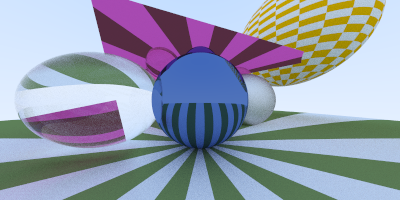
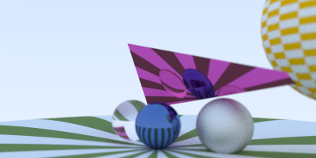

# Basic CPU Ray Tracer
**Note: WIP**

_Based on_:

* 'Ray Tracing' books from Peter Shirley:
<http://in1weekend.blogspot.com/2016/01/ray-tracing-in-one-weekend.html>
* Material from PBRT book (Third ed.)
<http://www.pbr-book.org/3ed-2018/contents.html>

### Features implemented thus far:
* basic ray tracing
* per pixel aliasing
* sphere intersection (w normal + uv generation)
* triangle intersection (Moller Trumblore w normal and uv generation)
* look at camera
* camera defocus blur (dof)
* basic lambertian, metal, rough metal, dielectric materials
* texture lookup (procedural checkerboard)

## Building and Running

### Makefile
* cd \<checkout\_path\>
* make clean && make -j 8
* cd bin
* ./RayTracingInAWeekend
* You should see outputs generated at:
	* _\<checkout\_path\>/bin/RayTrace\_Image\_1.bmp_
	* _\<checkout\_path\>/bin/RayTrace\_Image\_2.bmp_
	* _\<checkout\_path\>/bin/RayTrace\_Image\_3.bmp_

### Xcode
* cd \<checkout\_path\>
* Open, Build and Run _RayTracingInAWeekend.xcodeproj_
* You should see outputs generated at _DerivedData⁩ ▸ ⁨RayTracingInAWeekend⁩ ▸ ⁨Build⁩ ▸ ⁨Products⁩ ▸ ⁨Debug / Release_
	* _RayTrace\_Image\_1.bmp_
	* _RayTrace\_Image\_2.bmp_ 
	* _RayTrace\_Image\_3.bmp_ 
⁩

## Output
Expected image output can be observed in _\<checkout\_path\>/img_ folder

## Other References:

* 'Fast, minimum storage ray-triangle intersection' Tomas Möller and Ben Trumbore. Journal of Graphics Tools, 2(1):21--28, 1997. http://www.graphics.cornell.edu/pubs/1997/MT97.pdf
